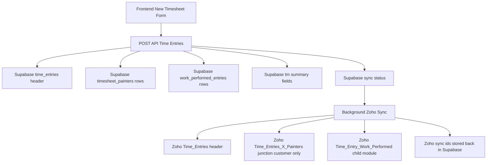

# Time Entry Persistence Plan: Supabase + Zoho CRM

## Objective

Create a reliable architecture for saving:
- Customer timesheet data
- Work Performed rows
- T&M Extra Work detail
- Sundry usage
- Painter labor rows
- Cost and billing-support data visible to the client in Zoho CRM

The corrected target model is:
- **Zoho CRM is the business source of truth for visible operational and billing data**
- **Supabase is the application system of record and sync buffer**
- **Everything needed for client review, labor cost analysis, billing, and profit reporting must exist in Zoho CRM in reportable form**
- **Work Performed and T&M detail must not be reduced to summary-only if the client needs to see and calculate from it**

This plan is based on the current code and documents already present in the repository.

---

## Current Codebase Reality

### What already exists

1. The frontend already captures normalized Work Performed data and separate T&M state.
2. The API already validates both `workPerformed` and `tmExtraWork` payloads.
3. The app already writes the main timesheet header and painter rows into Supabase.
4. The background sync flow to Zoho already exists for:
   - parent time entry creation
   - painter junction creation
5. Sundries and legacy extra work summary fields already exist on the main timesheet table.

### What is missing today

1. Work Performed rows are **validated but not persisted**.
2. T&M painter rows and T&M sundries are **captured in UI but not persisted**.
3. Zoho sync does **not know about Work Performed rows**.
4. Zoho sync does **not distinguish customer crew from T&M crew**.
5. The current schema cannot support reliable reconciliation for child records.

---

## Recommendation Summary

## Recommended target model

### Supabase
Use Supabase for all detailed operational storage:
- `time_entries` = header
- `timesheet_painters` = all labor rows with section tagging
- `work_performed_entries` = one row per work item
- `timesheet_sundries` = optional normalized child rows if you want future-proofing
- `sync_outbox` or equivalent sync tracking table = optional but strongly recommended

### Zoho CRM
Use Zoho for reporting-facing records:
- Keep `Time_Entries` as the parent header module
- Add a new custom related module such as `Time_Entry_Work_Performed`
- Keep T&M as summary fields on `Time_Entries`
- Do **not** put Work Performed into a subform if detailed reporting matters
- Do **not** create a separate detailed T&M child model yet unless billing/reporting later demands it

### Why this is the best fit

1. It respects your selected hybrid approach.
2. It avoids Zoho's two-subform limitation.
3. It preserves detailed Work Performed analytics.
4. It minimizes CRM complexity for T&M.
5. It matches the current write-behind pattern already implemented in the app.

---

## Target Data Architecture

---

## Detailed Architecture Decision

## 1. Source of truth

### Supabase must be the master system
Supabase should hold the complete and auditable record because it can safely store:
- normalized Work Performed rows
- customer and T&M labor separation
- retry and reconciliation metadata
- future billing logic
- future edits without Zoho field constraints

### Zoho CRM should be a reporting and business-visibility copy
Zoho should receive:
- the parent timesheet header
- the customer labor junctions already supported today
- Work Performed child records for visibility and reporting
- T&M summary fields only

This avoids over-modeling Zoho before the billing/reporting rules are fully stable.

---

## 2. Supabase schema plan

## 2.1 Extend `time_entries`

Keep the existing table as the header, but add explicit T&M and sync fields.

### Add fields
- `tm_enabled boolean not null default false`
- `tm_total_hours numeric or text default 0`
- `tm_notes text default ''`
- `tm_has_sundries boolean not null default false`
- `tm_has_work_performed boolean not null default false`
- `sync_version integer not null default 1`
- `last_sync_attempt_at timestamptz null`
- `last_sync_error text null`
- `sync_state text not null default 'pending'`

### Keep existing legacy-compatible fields
- keep `extra_hours`
- keep `extra_work_description`

### Recommended rule
- `extra_hours` mirrors `tm_total_hours`
- `extra_work_description` mirrors `tm_notes`

This keeps older logic and existing Zoho mappings working while new code adopts explicit T&M fields.

---

## 2.2 Extend `timesheet_painters`

Add a section discriminator so the same table can hold both customer and T&M labor.

### Add fields
- `section text not null default 'customer'`
- `sort_order integer null`
- `zoho_sync_enabled boolean not null default true`

### Allowed section values
- `customer`
- `tm`

### Important index change
The current uniqueness constraint on `(timesheet_id, painter_id)` is too restrictive if the same painter can appear in both customer and T&M on the same day.

### Replace with
Unique on:
- `(timesheet_id, painter_id, section)`

Without this change, the hybrid model will break for valid business scenarios.

---

## 2.3 Create `work_performed_entries`

Create one row per Work Performed line item for both customer and T&M contexts.

### Columns
- `id uuid primary key`
- `timesheet_id varchar not null`
- `section text not null default 'customer'`
- `area text not null`
- `group_code text not null`
- `group_label text not null`
- `task_code text not null`
- `task_label text not null`
- `quantity numeric not null default 0`
- `labor_minutes integer not null default 0`
- `paint_gallons numeric not null default 0`
- `primer_gallons numeric not null default 0`
- `primer_source text not null default 'stock'`
- `count numeric null`
- `linear_feet numeric null`
- `stair_floors numeric null`
- `door_count numeric null`
- `window_count numeric null`
- `handrail_count numeric null`
- `sort_order integer null`
- `zoho_work_performed_id varchar null`
- `sync_state text not null default 'pending'`
- `last_sync_error text null`
- `created_at timestamptz default now()`
- `updated_at timestamptz default now()`

### Section rule
- Customer Work Performed rows use `section = 'customer'`
- T&M Work Performed rows use `section = 'tm'`

### Why this matters
The UI already maintains two separate Work Performed lists. Persisting them into one normalized table with a `section` flag is the cleanest design and keeps reporting flexible.

---

## 2.4 T&M sundries decision

### Best immediate option
Do **not** add separate T&M sundry columns to `time_entries`.

### Instead
Create a normalized table if T&M sundries matter operationally:

`timesheet_sundries`
- `id`
- `timesheet_id`
- `section` with values `customer` or `tm`
- `item_code`
- `item_label`
- `quantity`
- `sort_order`

### Why
Your current main sundries are flattened into header columns because Zoho already mirrors them. That works for customer-level sundries today. But the T&M branch in the UI is already separate. If you later need T&M sundry billing, a normalized child table is safer than adding another wide set of columns.

### If you want minimum-change implementation
Phase 1 can skip T&M sundry persistence entirely if the business does not need it immediately.

---

## 3. Zoho CRM model plan

## 3.1 Keep `Time_Entries` as the header module

Use the existing parent module for:
- foreman
- project/job
- date
- notes
- customer sundries summary
- total crew hours
- T&M summary fields

### Add these T&M summary fields if not present
- `TM_Enabled` checkbox
- `TM_Total_Hours` number or decimal
- `TM_Notes` multiline
- `TM_Work_Performed_Count` number
- `TM_Painter_Count` number
- optionally `TM_Has_Sundries` checkbox

### Keep existing fields
- `Extra_Hours`
- `Extra_Work_Description`

If older automations depend on them, map both old and new fields during transition.

---

## 3.2 Create a new Zoho child module for Work Performed

### Recommended module name
`Time_Entry_Work_Performed`

### Lookup relationships
- lookup to `Time_Entries`
- optional lookup to `Deals` or `Projects` if useful for reporting
- optional lookup to `Portal_Users` or foreman if direct reporting requires it

### Fields
- `Name`
- `Time_Entry` lookup
- `Project` lookup
- `Foreman` lookup or reference field
- `Section` picklist with `Customer` and `T&M`
- `Work_Date`
- `Area`
- `Group_Code`
- `Group_Label`
- `Task_Code`
- `Task_Label`
- `Quantity`
- `Labor_Minutes`
- `Paint_Gallons`
- `Primer_Gallons`
- `Primer_Source`
- `Count`
- `Linear_Feet`
- `Stair_Floors`
- `Door_Count`
- `Window_Count`
- `Handrail_Count`
- `Sort_Order`
- `Supabase_Row_Id`
- `Sync_Version`

### Why a child module is better than a subform
1. Better reporting and filtering
2. Cleaner sync retries per row
3. Supports many records without header bloat
4. Avoids consuming precious subform slots
5. Easier future automation and dashboards

---

## 3.3 Zoho painter handling

### Customer painters
Keep the existing painter junction sync that already exists in the code.

### T&M painters
Do not sync detailed T&M painter rows to Zoho in phase 1.

### Instead sync only summary fields on `Time_Entries`
- T&M painter count
- T&M total hours
- T&M notes

### Why
This matches your chosen hybrid strategy and avoids introducing a second detailed child structure before there is proven CRM reporting need.

If later required, a new related module such as `Time_Entry_TM_Labor` can be added without redesigning Supabase.

---

## 4. End-to-end save flow

## 4.1 Frontend payload handling

The UI in the new entry page already has:
- customer painters
- customer sundries
- customer Work Performed
- T&M enable flag
- T&M painters
- T&M sundries
- T&M Work Performed

### Required payload adjustment
`tmExtraWork` should be treated as a first-class structured object and should carry:
- `painters`
- `notes`
- `totalHours`
- `sundryItems`
- `workPerformed`

The current API schema already supports this shape, which is a strong foundation.

---

## 4.2 API write sequence

### Blocking transaction in Supabase
The API route should do the following in one database transaction:

1. insert `time_entries` header
2. insert customer painter rows with `section = 'customer'`
3. insert T&M painter rows with `section = 'tm'` if present
4. insert customer Work Performed rows with `section = 'customer'`
5. insert T&M Work Performed rows with `section = 'tm'` if present
6. insert customer sundries and T&M sundries if normalized child table is adopted
7. set sync status fields to pending

### Critical design rule
If any of the above inserts fail, the whole transaction must roll back.

This is the core requirement for a foolproof save path.

---

## 4.3 Background sync sequence to Zoho

After Supabase commits successfully:

1. create or reuse Zoho `Time_Entries` parent
2. sync customer painter junctions
3. sync Work Performed child rows into `Time_Entry_Work_Performed`
4. update Supabase with returned Zoho IDs
5. mark rows and header as synced only when all required sync operations succeed

### Sync order rationale
- parent first because children need the CRM parent id
- customer painter junctions second because that path already exists
- Work Performed children third because they depend on the same parent

---

## 4.4 Sync status model

### Header sync status
A timesheet should not be marked fully synced until:
- parent Zoho time entry exists
- required customer painter rows are synced or intentionally skipped
- required Work Performed rows are synced

### Child sync status
Each Work Performed row should carry its own sync status in Supabase.

This prevents one failed child row from forcing blind re-creation of every row.

---

## 5. Validation and business rules

## 5.1 Payload validation rules

### Work Performed
For every row:
- `area`, `groupCode`, `taskCode` required
- numeric values coerced to non-negative
- `primerSource` only `stock` or `retail`
- `taskCode` must exist in the config from the app
- `sortOrder` must be deterministic

### T&M rules
- `tm_enabled = true` if any T&M painters, T&M sundries, or T&M Work Performed rows exist
- if T&M is disabled, all T&M child arrays should be ignored or cleared before persistence
- `tm_total_hours` should be computed from T&M painter rows, not trusted from client only

### Painter rules
- same painter may appear once in customer and once in T&M
- duplicate painter inside the same section should be blocked

---

## 5.2 Config-to-database alignment

The Work Performed tasks in the config file are authoritative for:
- `taskCode`
- `taskLabel`
- field visibility
- measurement semantics

### Recommended safeguard
Create a shared validation helper that checks submitted Work Performed rows against the config before writing to Supabase.

This prevents stale UI payloads or manual API misuse from inserting invalid task codes.

---

## 6. Idempotency and retry design

## 6.1 Main risk today
Background retries can accidentally create duplicate Zoho child records if there is no stable external identifier per child row.

## 6.2 Required fix
Every syncable child record should have a stable Supabase id and should send that id to Zoho in a dedicated field.

### For Work Performed rows
Use `Supabase_Row_Id` in Zoho.

### Retry strategy
On retry:
1. if `zoho_work_performed_id` exists in Supabase, update that row in Zoho if needed
2. else search Zoho by `Supabase_Row_Id`
3. only create a new record if none exists

This is mandatory for a foolproof plan.

---

## 6.3 Header idempotency

Use the existing `zoho_time_entry_id` on the Supabase header.

### Rule
If the Supabase row already has a Zoho parent id, never create a second parent record.

---

## 7. Reconciliation and observability

## 7.1 Add operational visibility

Track:
- `sync_state`
- `last_sync_attempt_at`
- `last_sync_error`
- record counts expected vs synced

### Recommended states
- `pending`
- `partial`
- `synced`
- `failed`

---

## 7.2 Reconciliation job

Add a server-side retry/reconciliation process that can:
- find headers with `pending`, `partial`, or `failed`
- inspect missing child sync ids
- re-run only the missing pieces

The existing retry flow in the app is a good base, but the new design should become child-aware, not header-only.

---

## 7.3 Audit queries to support

You should be able to answer:
- which timesheets are saved in Supabase but not in Zoho
- which Work Performed rows failed Zoho sync
- which timesheets have T&M detail in Supabase but only summary in Zoho
- which painters were synced as customer labor only

---

## 8. Recommended implementation phases

## Phase 1: Safe persistence foundation
- add schema changes in Supabase
- persist customer and T&M rows in Supabase transactionally
- keep current Zoho parent sync
- keep current customer painter sync
- add sync metadata fields

### Outcome
No more data loss between UI and database.

---

## Phase 2: Work Performed CRM sync
- create `Time_Entry_Work_Performed` module in Zoho
- sync customer and T&M Work Performed rows as child records
- store Zoho child ids in Supabase
- add retry-safe upsert logic

### Outcome
Detailed production data becomes reportable in CRM.

---

## Phase 3: T&M reporting enhancement
- keep T&M summary on the parent
- decide whether T&M sundries need CRM visibility
- only add a dedicated T&M child module if business reporting proves necessary

### Outcome
CRM stays lean while preserving future expansion.

---

## 9. Concrete codebase plan

## Backend changes

### Update API route
In the time entry API route:
- persist `validated.workPerformed`
- persist `validated.tmExtraWork.painters`
- persist `validated.tmExtraWork.workPerformed`
- compute and store explicit T&M summary fields
- wrap all writes in a transaction

### Update schema definitions
In the schema file:
- add new table definitions
- extend painter table with `section`
- replace unique key to include `section`

### Update sync utilities
In sync utilities:
- load customer painters only for the existing painter junction sync
- load Work Performed child rows for separate CRM sync
- mark partial success correctly
- retry only missing child records

---

## Frontend changes

### Keep current UX
The new entry screen structure is already aligned with the target architecture.

### Only tighten submission rules
- ensure T&M object is always structurally clean
- ensure empty T&M state is not sent as noisy data
- ensure deterministic ordering for Work Performed lists

---

## Zoho changes

### Parent module
Add T&M summary fields and any helper counts.

### New child module
Create `Time_Entry_Work_Performed` with lookup to `Time_Entries` and a `Supabase_Row_Id` field.

---

## 10. Final recommendation

### Best architecture choice
1. **Supabase remains the full source of truth**
2. **Zoho `Time_Entries` remains the header**
3. **Create a new Zoho related module for Work Performed**
4. **Keep T&M detailed rows in Supabase only in phase 1**
5. **Expose T&M summary on Zoho Time Entry**
6. **Use per-row sync ids and statuses for foolproof retries**

### Why this is the best plan for this codebase
- It fits the payloads already present in the frontend and API
- It requires the least destructive change to the current sync design
- It avoids Zoho subform limits
- It gives you reportable Work Performed data in CRM
- It keeps T&M flexible until reporting requirements are fully proven
- It creates a path to reliable reconciliation instead of one-shot sync attempts

---

## Implementation checklist for the next mode

- Add Supabase migrations for `time_entries`, `timesheet_painters`, and `work_performed_entries`
- Decide whether `timesheet_sundries` is phase 1 or phase 2
- Update Drizzle schema definitions
- Update API insert path to transactional writes
- Persist both customer and T&M Work Performed rows
- Persist T&M painter rows with section tagging
- Add sync status fields on parent and child rows
- Create Zoho `Time_Entry_Work_Performed` module
- Add Zoho field mapping for Work Performed child sync
- Add idempotent retry logic using `Supabase_Row_Id`
- Update reconciliation flow to be child-aware
