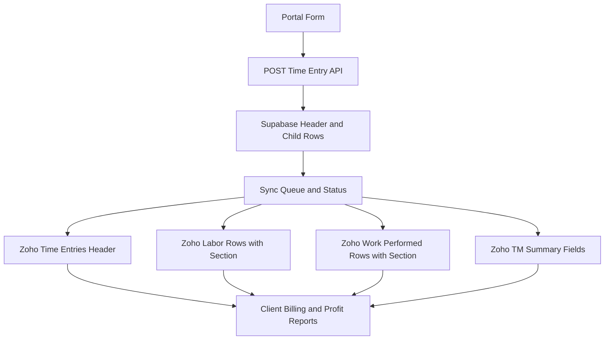

# Time Entry Persistence Plan V2: Zoho CRM First, Supabase Supporting

## Executive Decision

The plan must be built around this business rule:

- **Zoho CRM is the client-visible source of truth**
- **Everything required for billing, labor cost analysis, profitability, and operational review must be present in Zoho CRM in reportable form**
- **Supabase still matters, but only as the portal database, integration layer, retry buffer, and app-performance store**

Because of that, the earlier summary-only T&M strategy is not sufficient.

The corrected recommendation is:
- Keep [`Time_Entries`](src/lib/sync-utils.ts:106) as the primary CRM header
- Add **one new related CRM module for Work Performed rows**
- Use **one unified labor-detail CRM structure** for both customer and T&M labor, distinguished by section
- Keep Supabase structurally aligned with Zoho so every reportable record can be synced and reconciled one-to-one

This fits your note that a Zoho module can only have two subforms. Instead of spending subforms on high-volume data, use **related modules**, which are much better for reporting, syncing, and future growth.

---

## Why the architecture must change

### What the business needs
The client must be able to see in Zoho CRM:
- what work was performed
- who worked
- which hours were customer vs T&M
- what materials and sundries were used
- how much labor cost was incurred per painter
- what to bill
- what profit was made

### Why summary-only T&M fails
If T&M is only stored as summary fields on the parent record, the client cannot reliably:
- calculate cost per painter
- audit individual T&M labor lines
- separate customer labor from T&M labor for margin analysis
- reconcile work detail against billing detail

So the CRM design must store **detail rows**, not just summaries.

---

## Current codebase assessment

Based on the current implementation:

### Already present
- [`workPerformed` config and normalized model](src/config/workPerformed.ts:128)
- [`tmExtraWork` payload schema](src/app/api/time-entries/route.ts:47)
- [`workPerformed` payload schema](src/app/api/time-entries/route.ts:32)
- current parent timesheet save in [`POST`](src/app/api/time-entries/route.ts:201)
- current customer painter save in [`timesheetPainters`](src/lib/schema.ts:92)
- current Zoho parent plus painter sync in [`syncTimesheetToZoho()`](src/lib/sync-utils.ts:91)

### Missing for the real business requirement
- no persistence for customer Work Performed detail
- no persistence for T&M painter detail beyond summary fields
- no persistence for T&M Work Performed detail
- no CRM sync for Work Performed detail rows
- no CRM sync for T&M labor detail rows
- no child-level retry-safe synchronization model

---

## Correct target architecture

---

## Final recommended Zoho CRM model

## 1. Keep `Time_Entries` as the parent header module

This remains the top-level record visible to the client.

### Parent record should contain
- Time Entry Name
- Project lookup
- Foreman lookup
- Time Entry Date
- Notes
- change order if still needed
- customer sundry summary fields
- customer total crew hours
- T&M total crew hours
- total labor cost summary
- total customer labor cost summary
- total T&M labor cost summary
- total sundry cost summary if desired
- billing status fields if desired
- sync health fields if desired for admin use

### Keep on parent only what is truly header data
Parent should summarize, but not replace, child detail.

---

## 2. Add a new Zoho related module: `Time_Entry_Work_Performed`

This module should hold **all Work Performed lines**, both customer and T&M.

### Why this module is mandatory
The Work Performed structure in [`WorkPerformedEntry`](src/config/workPerformed.ts:128) is already line-based. That means it naturally maps to a CRM child module.

### Fields for this module
- `Name`
- `Time_Entry` lookup to `Time_Entries`
- `Project` lookup
- `Foreman` lookup
- `Work_Date`
- `Section` picklist with `Customer` and `T&M`
- `Area`
- `Group_Code`
- `Group_Label`
- `Task_Code`
- `Task_Label`
- `Quantity`
- `Labor_Minutes`
- `Paint_Gallons`
- `Primer_Gallons`
- `Primer_Source`
- `Count`
- `Linear_Feet`
- `Stair_Floors`
- `Door_Count`
- `Window_Count`
- `Handrail_Count`
- `Sort_Order`
- `Supabase_Row_Id`
- `Portal_Sync_Version`
- optional `Unit_Cost`
- optional `Extended_Cost`
- optional `Billing_Category`

### Why not a subform
A subform is weaker here because:
- reporting is harder
- sync retries are harder
- row volumes can grow
- you already have a two-subform limit
- related modules are better for dashboards and automation

---

## 3. Use one Zoho labor-detail structure for both customer and T&M

Do **not** create a separate T&M labor module.

Instead, store all painter labor rows in one CRM structure, with a field that identifies whether the row is customer work or T&M work.

### Why this is the better CRM design
The client still needs to know:
- which painter worked
- how many hours they worked
- how much that labor cost
- how much to bill
- what profit came from the T&M work

But that does **not** require a separate module. It only requires row-level labor detail plus a section field.

### Recommended labor model
Best target structure:
- `Time_Entry_Labor` related module for **all** labor rows
- `Section` picklist with `Customer` and `T&M`

### Fields for this module
- `Name`
- `Time_Entry` lookup to `Time_Entries`
- `Project` lookup
- `Foreman` lookup
- `Painter` lookup if available
- `Painter_Name`
- `Work_Date`
- `Section` picklist with `Customer` and `T&M`
- `Start_Time`
- `End_Time`
- `Lunch_Start`
- `Lunch_End`
- `Total_Hours`
- `Pay_Rate_Type`
- `Hourly_Cost_Rate`
- `Labor_Cost`
- `Billable_Rate`
- `Billable_Amount`
- `Gross_Profit`
- `Gross_Margin`
- `Supabase_Row_Id`
- `Portal_Sync_Version`

### If Zoho already has painter pay data elsewhere
Then this module can store:
- painter lookup
- total hours
- resolved labor cost at the time of save
- optional rate snapshot fields for audit stability

That is usually better than recalculating old records from a changing painter master rate.

---

## 4. Customer labor in Zoho

### Recommended approach
Do not split customer labor and T&M labor into separate CRM entities.

The CRM should support one labor-detail structure where every row has:
- painter
- hours
- cost
- section equals `Customer` or `T&M`

### Migration-friendly interpretation
If the current customer painter junction must remain temporarily for implementation reasons, treat it as a transitional path only.

The plan target should still be:
- one `Time_Entry_Labor` module for **all** labor rows
- one `Time_Entry_Work_Performed` module for **all** work rows
- one `Time_Entries` header

### Strong recommendation
This unified labor model is cleaner than:
- a customer junction for one type of labor, and
- a separate T&M-only labor module for the other type

The CRM reporting model should be unified even if implementation is phased.

---

## Correct Supabase role

Supabase should not be treated as the business truth over Zoho. It should be treated as:
- the portal transaction database
- the place where the app writes first
- the place that stores retry metadata
- the place that stores integration ids and sync health
- the place that preserves app performance and consistency

### But structurally
Supabase should still mirror the CRM detail model closely, so every reportable CRM row has a corresponding Supabase row.

That means:
- one Supabase header row per timesheet
- one Supabase child row per customer labor line
- one Supabase child row per T&M labor line
- one Supabase child row per Work Performed line
- one Supabase child row per sundry line if T&M sundries will matter

---

## Recommended Supabase schema

## 1. `time_entries`
Keep the existing header table but extend it.

### Add
- `tm_enabled`
- `tm_total_hours`
- `tm_notes`
- `customer_total_labor_cost`
- `tm_total_labor_cost`
- `total_labor_cost`
- `sync_state`
- `last_sync_attempt_at`
- `last_sync_error`
- `zoho_time_entry_id`

### Keep
- existing notes and sundry fields
- existing `extra_hours` and `extra_work_description` during migration for backward compatibility

---

## 2. `timesheet_painters`
This table should become the labor-detail source for both customer and T&M.

### Add
- `section` with values `customer` or `tm`
- `pay_rate_type`
- `hourly_cost_rate`
- `labor_cost`
- `billable_rate` if known
- `billable_amount` if known
- `gross_profit` if known
- `sort_order`
- `zoho_labor_row_id`
- `sync_state`
- `last_sync_error`

### Fix uniqueness
The current unique key on [`timesheetPainters`](src/lib/schema.ts:107) must change.

Replace uniqueness on:
- `(timesheet_id, painter_id)`

With uniqueness on:
- `(timesheet_id, painter_id, section, start_time, end_time)`

Or, if you want simpler retry behavior:
- generate a row UUID and rely on that as the stable identity
- do not over-constrain uniqueness beyond obvious duplicates

### Why
The same painter may legitimately appear in both customer and T&M sections on the same day.

---

## 3. `work_performed_entries`
Create a normalized table for all work detail.

### Columns
- `id`
- `timesheet_id`
- `section`
- `area`
- `group_code`
- `group_label`
- `task_code`
- `task_label`
- `quantity`
- `labor_minutes`
- `paint_gallons`
- `primer_gallons`
- `primer_source`
- `count`
- `linear_feet`
- `stair_floors`
- `door_count`
- `window_count`
- `handrail_count`
- `sort_order`
- `zoho_work_performed_id`
- `sync_state`
- `last_sync_error`

### Important
Store both:
- customer Work Performed rows
- T&M Work Performed rows

using `section`.

---

## 4. `timesheet_sundries`
If the client needs T&M sundries visible and billable in Zoho, use a normalized table.

### Columns
- `id`
- `timesheet_id`
- `section`
- `item_code`
- `item_label`
- `quantity`
- `unit_cost`
- `extended_cost`
- `zoho_sundry_row_id`
- `sync_state`

### Why this matters
Customer sundries are currently flattened into the header and already map reasonably to CRM fields.

T&M sundries are different because they may need:
- separate billing treatment
- separate profitability treatment
- separate visibility from customer base work

### CRM options for T&M sundries
Best option:
- use the existing parent summary fields for totals
- store detail in a related module only if the client truly needs line-by-line visibility

Since your immediate concern was specifically Work Performed and T&M Extra Work, this can be phase 2 unless billing depends on T&M sundry detail now.

---

## Best CRM design options

## Option A: Transitional approach
- `Time_Entries` header
- existing customer painter junction remains temporarily
- new `Time_Entry_Work_Performed` module
- labor rows move toward one unified `Time_Entry_Labor` structure with `Section`

### Pros
- allows phased implementation
- acknowledges current codebase constraints

### Cons
- temporary reporting complexity until labor is fully unified

---

## Option B: Best long-term CRM model
- `Time_Entries` header
- `Time_Entry_Labor` module for both customer and T&M
- `Time_Entry_Work_Performed` module for both customer and T&M

### Pros
- cleanest reporting
- cleaner cost and profit calculations
- one labor model only
- easier dashboards

### Cons
- larger change from current codebase
- requires reworking existing painter-junction sync

---

## Recommendation
Choose **Option B** if you want the truly best architecture.

Choose **Option A** only if you want a temporary transition path while still targeting unified labor.

Given your phrase **best plan based on the current codebase**, the practical answer is:
- target **Option B** as the actual CRM design
- use **Option A** only as a short-lived migration path if implementation sequencing requires it

---

## End-to-end save strategy

## 1. Portal save transaction
In [`POST`](src/app/api/time-entries/route.ts:201), the app should save all records in one Supabase transaction:

1. insert `time_entries`
2. insert customer labor rows into `timesheet_painters` with `section = customer`
3. insert T&M labor rows into `timesheet_painters` with `section = tm`
4. insert customer Work Performed rows into `work_performed_entries`
5. insert T&M Work Performed rows into `work_performed_entries`
6. insert sundry rows if normalized sundry table is adopted
7. mark sync state as pending

### Non-negotiable rule
The portal must never save only the header if child detail exists.

Either everything required for the portal save is committed, or none of it is.

---

## 2. Zoho sync sequence
After the Supabase transaction commits:

1. create or update parent `Time_Entries`
2. sync labor detail rows with `section = customer` or `section = tm`
3. sync Work Performed detail rows with `section = customer` or `section = tm`
5. sync parent summary totals
6. write returned Zoho ids back to Supabase
7. mark rows synced only after success

---

## 3. Zoho must receive enough data for billing
The CRM payload must include enough information so the client can compute or directly see:
- labor hours
- labor cost
- T&M billable amount
- Work Performed quantities and production context
- section split between customer and T&M

If some values are calculated in the portal, store the calculated snapshot in Zoho too.

Do not rely on hidden portal-only calculations if the client cannot access them.

---

## Cost and profit data strategy

## Where cost should live
To support billing and profitability in Zoho CRM, cost-related fields should be stored on labor detail rows and optionally summarized on the parent.

### On labor rows
Store:
- hourly cost rate snapshot
- total hours
- labor cost snapshot
- optional billable rate snapshot
- optional billable amount snapshot

### On parent
Store rollups:
- total customer labor cost
- total T&M labor cost
- total labor cost
- total billable T&M amount
- total estimated profit or margin if useful

### Why snapshots matter
If a painter's pay rate changes later, historical records must still show the original labor cost used for that day's billing and reporting.

---

## Validation requirements

## Work Performed validation
Before saving, validate each submitted line against the config in [`WORK_PERFORMED_STRUCTURE`](src/config/workPerformed.ts:151):
- valid area
- valid group
- valid task
- only expected measurements allowed
- all numeric fields coerced to non-negative values

## Labor validation
- no duplicate painter rows inside the same section unless intentionally supported
- start time must be before end time
- total hours recomputed server-side
- labor cost recomputed or validated server-side

## T&M validation
- if T&M rows exist, `tm_enabled` must be true
- T&M summary fields must be computed from saved detail, not only trusted from client payload

---

## Idempotency and reconciliation

## Problem to solve
Current retry logic in [`retryFailedSyncs()`](src/lib/sync-utils.ts:179) is header-centric. That is not enough once there are multiple child modules.

## Required fix
Every syncable row must have:
- a stable Supabase row id
- a matching Zoho id column
- a row-level sync state
- a row-level last error

## Zoho external identity strategy
Add a field like `Supabase_Row_Id` on every Zoho child module.

### Retry rule
On retry:
1. if Supabase already has the Zoho row id, update that row
2. else search Zoho by `Supabase_Row_Id`
3. only create when no CRM row exists

This is essential to avoid duplicate child rows in Zoho.

---

## Recommended implementation phases

## Phase 1: Correct persistence foundation
- extend Supabase schema
- save customer and T&M labor detail rows
- save customer and T&M Work Performed rows
- add row-level sync metadata
- keep current Zoho parent sync working

## Phase 2: Zoho Work Performed visibility
- create `Time_Entry_Work_Performed`
- sync both customer and T&M Work Performed rows
- expose all needed production data in Zoho

## Phase 3: Zoho T&M labor visibility
- create or complete unified `Time_Entry_Labor`
- sync both customer and T&M labor detail rows with cost fields and `Section`
- expose billable and profit-support data in Zoho without a separate T&M-only module

## Phase 4: Optional unification
- retire any temporary split labor path if still present
- consolidate CRM reporting into one labor detail structure

---

## Final recommendation

### If you want the best plan for the real business need
The correct architecture is:

1. **Zoho CRM must contain all client-visible billing and cost detail**
2. **Supabase must persist the same detail first for transactional safety**
3. **Work Performed must be a dedicated Zoho related module**
4. **Labor must be stored in detailed Zoho rows with a section field, not as T&M summary fields only**
5. **Customer and T&M detail must be clearly separated by section**
6. **Every child row must support idempotent sync and reconciliation**

### Practical recommendation for this codebase
- preserve the current parent timesheet flow
- add detailed persistence for all missing child rows in Supabase
- add one Zoho module for Work Performed
- unify labor in Zoho under one module or one clearly unified related-record structure using `Section`
- treat any existing customer painter path as transitional, not the target design

This is the most realistic plan that satisfies both:
- the current codebase constraints
- the client's need to see all operational, billing, cost, and profit-driving data in Zoho CRM
