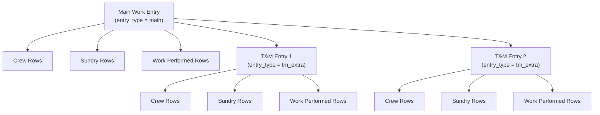

# Implementation Plan: Unified Work Entry Architecture

## Architecture Overview

T&M extra work is **not** a set of fields on a parent time entry. It is its own entry record, linked back to the main one. Both main and T&M entries share the exact same structure.



---

## Supabase Schema

### Table: `work_entries`

Replaces the current `time_entries` as the core entity. Both main and T&M entries live here.

| Column | Type | Notes |
|---|---|---|
| [id](file:///c:/Users/Administrator/Documents/GitHub/acom-painting-time-entry-app/src/app/%28main%29/entry/new/page.tsx#449-523) | UUID PK | `gen_random_uuid()` |
| `entry_type` | TEXT | `'main'` or `'tm_extra'` |
| `parent_entry_id` | UUID NULL | FK → `work_entries(id)`. NULL for main entries |
| `job_id` | TEXT | FK to jobs |
| `job_name` | TEXT | Denormalized for display |
| `foreman_id` | TEXT | FK to foremen |
| `entry_date` | DATE | |
| `notes` | TEXT | |
| `change_order` | TEXT | Main entries only |
| `status` | TEXT | `'draft'`, `'submitted'`, `'synced'` |
| `tm_sequence` | INTEGER NULL | 1, 2, 3… for T&M children |
| `display_label` | TEXT NULL | e.g. "T&M Extra Work - Accent Walls" |
| `total_crew_hours` | NUMERIC | Computed summary |
| `zoho_record_id` | TEXT NULL | Zoho ID after sync |
| `sync_state` | TEXT | `'pending'`, `'synced'`, `'failed'` |
| `last_sync_error` | TEXT NULL | |
| `created_at` | TIMESTAMPTZ | `now()` |
| `updated_at` | TIMESTAMPTZ | `now()` |

> [!IMPORTANT]
> The current `time_entries` table has sundry columns flattened directly on the parent (e.g. `masking_paper_roll`, `plastic_roll`, etc.). The new architecture moves these into a normalized `work_entry_sundry_rows` table. This is a breaking change that requires migrating existing data.

### Table: `work_entry_crew_rows`

Replaces the current `timesheet_painters`. One row per painter per entry.

| Column | Type | Notes |
|---|---|---|
| [id](file:///c:/Users/Administrator/Documents/GitHub/acom-painting-time-entry-app/src/app/%28main%29/entry/new/page.tsx#449-523) | UUID PK | |
| `work_entry_id` | UUID | FK → `work_entries(id)` |
| `painter_id` | VARCHAR | FK → painters |
| `painter_name` | TEXT | Denormalized |
| `start_time` | TEXT | HH:MM |
| `end_time` | TEXT | HH:MM |
| `lunch_start` | TEXT | |
| `lunch_end` | TEXT | |
| `total_hours` | NUMERIC(10,2) | |
| `pay_rate_type` | TEXT NULL | Future: for cost calc |
| `labor_cost` | NUMERIC(12,2) NULL | Future: snapshot |
| `zoho_record_id` | TEXT NULL | |
| `sync_state` | TEXT | `'pending'`, `'synced'` |
| `created_at` | TIMESTAMPTZ | |

### Table: `work_entry_sundry_rows`

Replaces the flattened sundry columns on `time_entries`. One row per sundry item per entry.

| Column | Type | Notes |
|---|---|---|
| [id](file:///c:/Users/Administrator/Documents/GitHub/acom-painting-time-entry-app/src/app/%28main%29/entry/new/page.tsx#449-523) | UUID PK | |
| `work_entry_id` | UUID | FK → `work_entries(id)` |
| `sundry_name` | TEXT | e.g. "Masking Paper Roll" |
| `quantity` | NUMERIC(10,2) | |
| `unit_cost` | NUMERIC(12,2) NULL | Future |
| `total_cost` | NUMERIC(12,2) NULL | Future |
| `zoho_record_id` | TEXT NULL | |
| `sync_state` | TEXT | |
| `created_at` | TIMESTAMPTZ | |

### Table: `work_entry_work_rows`

Stores all Work Performed task rows. Same table for both main and T&M entries.

| Column | Type | Notes |
|---|---|---|
| [id](file:///c:/Users/Administrator/Documents/GitHub/acom-painting-time-entry-app/src/app/%28main%29/entry/new/page.tsx#449-523) | UUID PK | |
| `work_entry_id` | UUID | FK → `work_entries(id)` |
| `area` | TEXT | `'interior'` / `'exterior'` |
| `group_code` | TEXT | e.g. `gyp-walls-ceilings` |
| `group_label` | TEXT | e.g. `Gyp Walls/Ceilings` |
| `task_code` | TEXT | e.g. `prime-gyp-cut-roll-standard` |
| `task_label` | TEXT | Full readable label |
| `quantity` | NUMERIC | |
| `labor_hours` | NUMERIC | Decimal hours (e.g. 39.5) |
| `paint_gallons` | NUMERIC | |
| `primer_gallons` | NUMERIC | |
| `primer_source` | TEXT | `'stock'` / `'retail'` |
| `count` | INTEGER | Task-specific |
| `linear_feet` | NUMERIC | Task-specific |
| `stair_floors` | INTEGER | Task-specific |
| `door_count` | INTEGER | Task-specific |
| `window_count` | INTEGER | Task-specific |
| `handrail_count` | INTEGER | Task-specific |
| `sort_order` | INTEGER | |
| `zoho_record_id` | TEXT NULL | |
| `sync_state` | TEXT | |
| `created_at` | TIMESTAMPTZ | |

---

## Zoho CRM Structure

Based on your screenshots, you have already configured **Option A** (Single Module with Self-Lookup) perfectly. 

### Module 1: Time Entries (`CustomModule1` / `Time_Entries`)

This module handles **both** Main and T&M Extra entries.

| Your CRM Field Label | API Name | Data Type | Purpose |
|---|---|---|---|
| **Time Entry Name** | `Name` | Single Line | Display: e.g. "Main - 26001 - Murray... - 2026-03-17" |
| **Time Entry Type** | `Time_Entry_Type` | Pick List | `Main` or `T&M Extra` |
| **Parent Time Entry** | `Parent_Time_Entry` | Lookup | Null for Main. Points to Main ID for T&M. |
| **Job** | [Job](file:///c:/Users/Administrator/Documents/GitHub/acom-painting-time-entry-app/src/config/workPerformed.ts#35-42) | Lookup | Links to Job module |
| **Foreman** | `Portal_User` | Lookup | Links to Portal Users |
| **Date** | `Date` | Date | Work date |
| **Time Entry Note** | `Time_Entry_Note` | Multi Line | General notes |
| **Total Hours** | `Total_Hours` | Single Line | (Consider changing to Decimal if used for math) |
| **Extra Hours** | `Extra_Hours` | Single Line | *Deprecated in new model* |
| **Extra Work Description** | `Extra_Work_Description`| Multi Line | *Deprecated in new model* |
| *(Various Sundries)* | `Masking_Paper_Roll`, etc. | Number | *Will move to child module in Phase 2* |

### Module 2: Work Performed (`CustomModule5` / `Work_Performed` or similar)

This module handles the detailed work tasks.

| Your CRM Field Label | API Name | Data Type | Purpose |
|---|---|---|---|
| **Work... Name** | `Name` | Single Line | Computed Display Label |
| **Time Entry** | `Time_Entry` | Lookup | Points to the `Time_Entries` record |
| **Area** | [Area](file:///c:/Users/Administrator/Documents/GitHub/acom-painting-time-entry-app/src/config/workPerformed.ts#17-18) | Pick List | `Interior` / `Exterior` |
| **Group Code** | `Group_Code` | Single Line | e.g., `gyp-walls-ceilings` |
| **Group Label** | `Group_Label` | Single Line | e.g., `Gyp Walls/Ceilings` |
| **Task Code** | `Task_Code` | Single Line | e.g., `prime-gyp-cut-roll-standard` |
| **Task Label** | `Task_Label` | Single Line | Full readable task name |
| **Quantity** | [Quantity](file:///c:/Users/Administrator/Documents/GitHub/acom-painting-time-entry-app/src/app/%28main%29/entry/new/page.tsx#428-432) | Decimal | |
| **Labor Hours** | `Labor_Hours` | Decimal | Decimal hours (e.g. 39.5) |
| **Paint Gallons** | `Paint_Gallons` | Decimal | |
| **Primer Gallons** | `Primer_Gallons` | Decimal | |
| **Primer Source** | `Primer_Source` | Pick List | `Stock` / `Retail` |

*(Note: Ensure you add `Supabase_Row_Id` to both modules for safe idempotent syncing!)*

---

## Migration Strategy

### What changes from current codebase

| Current | New |
|---|---|
| `time_entries` table | → `work_entries` table |
| `timesheet_painters` table | → `work_entry_crew_rows` table |
| Sundry columns on `time_entries` | → `work_entry_sundry_rows` table |
| `extra_hours` / `extra_work_description` | → Child `work_entries` with `entry_type='tm_extra'` |
| No work performed persistence | → `work_entry_work_rows` table |
| Zoho `Time_Entries` module | → Zoho `Work Entries` module (or rename) |

### Migration phases

1. **Phase 1**: Create new tables in Supabase, update Drizzle schema
2. **Phase 2**: Update API route to save into new tables (keep backward compat read path)
3. **Phase 3**: Migrate existing `time_entries` data into `work_entries`
4. **Phase 4**: Create/update Zoho modules, build sync layer
5. **Phase 5**: Remove old tables and deprecated columns

---

## App Payload Shape & Saving Flow

The submit payload from the portal becomes a clean tree:

```json
{
  "mainEntry": {
    "jobId": "...",
    "jobName": "...",
    "date": "2026-03-17",
    "notes": "...",
    "painters": [ ... ],
    "workPerformed": [ ... ],
    "sundryItems": [ ... ]
  },
  "tmEntries": [
    {
      "notes": "Accent Walls",
      "painters": [ ... ],
      "workPerformed": [ ... ],
      "sundryItems": [ ... ]
    }
  ]
}
```

### The API Save Sequence:

1.  **Insert Main `work_entries` row:**
    *   `entry_type` = `'main'`
    *   `parent_entry_id` = `null`
    *   Gets `mainId`
2.  **Insert Main Children:**
    *   Crew rows linked to `mainId`
    *   Work Performed rows linked to `mainId`
3.  **Iterate `tmEntries`:**
    *   **Insert T&M `work_entries` row:**
        *   `entry_type` = `'tm_extra'`
        *   `parent_entry_id` = `mainId`
        *   Gets `tmId`
    *   **Insert T&M Children:**
        *   Crew rows linked to `tmId`
        *   Work Performed rows linked to `tmId`

*Every row is inserted with `sync_state = 'pending'` in a single Postgres transaction.*

---

## Summary Fields on Main Entry

For quick reporting without drilling into children:

| Field | Purpose |
|---|---|
| `tm_count` | Number of T&M child entries |
| `tm_total_hours` | Sum of all T&M crew hours |
| `tm_total_labor_cost` | Sum of all T&M labor cost |
| `grand_total_hours` | Main + all T&M hours |
| `tm_summary_text` | Auto-generated text summary |

These are computed in Supabase and pushed to Zoho.

---

## Verification Plan

### Automated Tests
- Submit a main entry with 2 T&M children via the API
- Verify `work_entries` has 3 rows (1 main + 2 T&M)
- Verify `parent_entry_id` is correctly set on T&M rows
- Verify crew/sundry/work rows are linked to correct entry IDs

### Manual Verification
- Submit through the portal UI
- Check Supabase Table Editor for all rows
- Verify Zoho CRM shows parent-child relationship
- Run a Zoho report filtering by Entry Type
